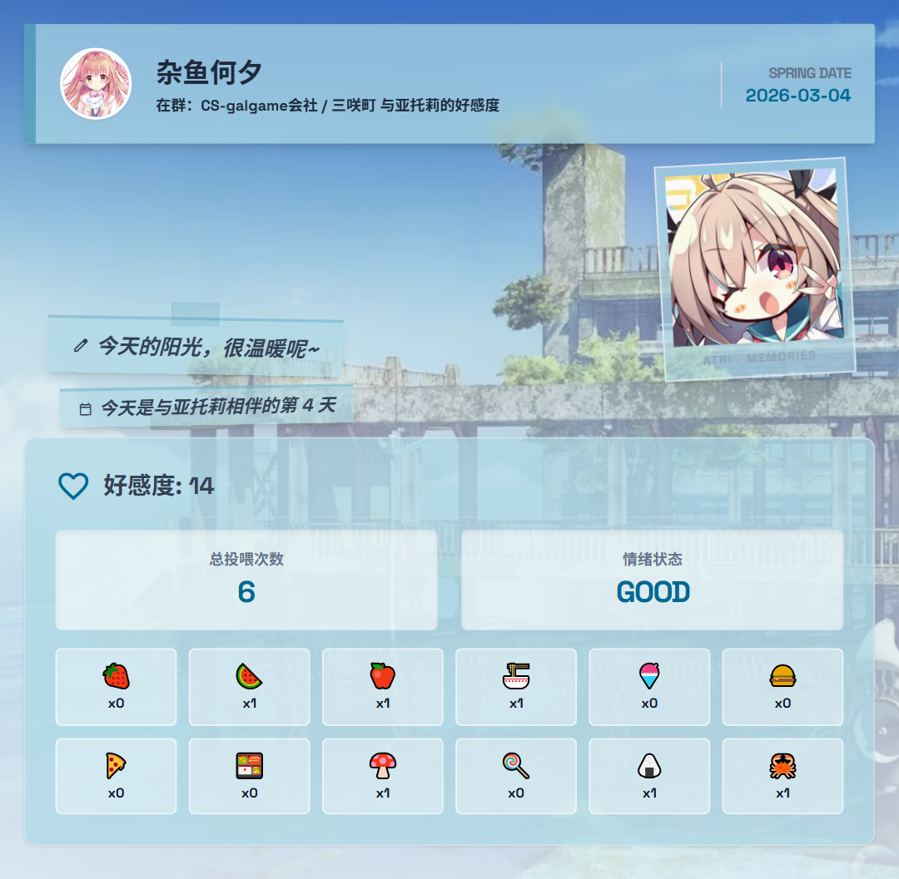
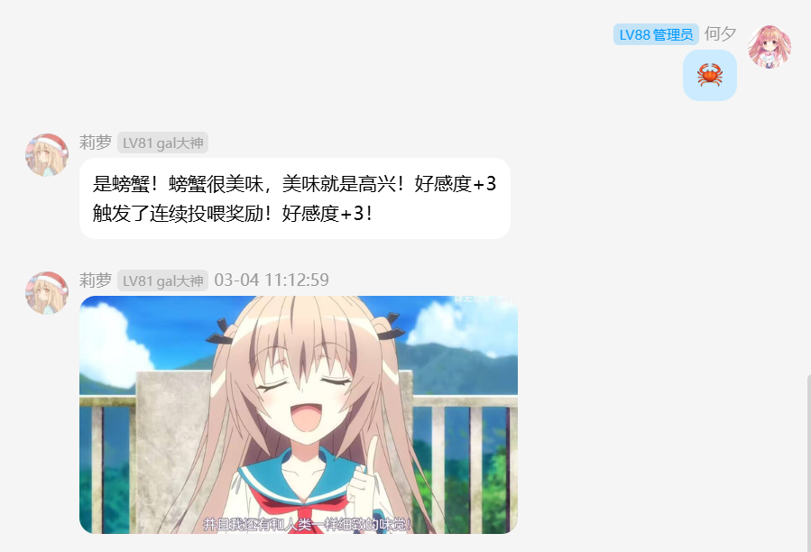
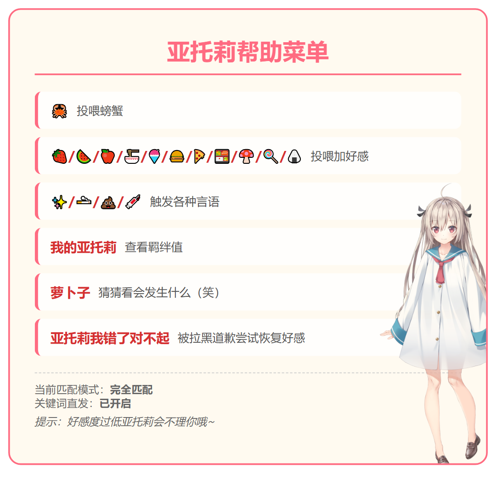

<div align="center">

![:name] (https://count.getloli.com/@astrbot_plugin_atrifeed?name=astrbot_plugin_atrifeed&theme=miku&padding=7&offset=0&align=top&scale=1&pixelated=1&darkmode=auto)

# AstrBot 亚托莉(ATRI) 投喂互动插件

基于AstrBot框架开发的高性能机器人互动插件。通过记录群内成员与亚托莉的互动数据，实现投喂、羁绊养成、黑名单惩罚等功能，并生成精美的个人羁绊名片。

目前还处于测试阶段，还有很多功能需要添加。如发现问题或者有有趣的想法欢迎提issue！

## ✨ 功能亮点

* **动态羁绊系统**：内置 SQLite 数据库，记录每位用户与亚托莉的好感度、投喂统计及原谅次数。
* **多样化投喂**：支持螃蟹、水果、主食等多种 emoji 投喂，每种食物均有独特的逻辑反馈与好感加成。
* **可视化名片**：基于 HTML 渲染引擎生成高清个人羁绊卡片，直观展示你与亚托莉的互动点滴。
* **智能黑名单**：严厉打击行为不端者（如发送 💩 或辱骂），好感度过低将触发拉黑逻辑，需诚恳道歉方可恢复（道歉恢复是有次数限制的）。
* **关键词路由**：内置自定义路由引擎，支持 **精确匹配**、**开头匹配** 或 **包含匹配**，让互动更自然。
* **兼容性处理**：自动适配不同版本的 AstrBot 数据路径，确保数据库与资源文件存放安全。

## 📂 文件架构

```text
astrbot_plugin_atrifeed/
├── main.py               # 插件主逻辑入口 (Star 类)
├── keyword_trigger.py    # 自定义关键词匹配路由引擎
├── metadata.yaml         # 插件元数据
├── _conf_schema.json     # 配置定义文件
├── LICENSE               # 项目许可证
├── logo.png              # 插件图标
├── src/                  # 核心源代码目录
│   ├── constants.py      # 常量定义与默认关键词路由配置
│   ├── database.py       # SQLite 数据库管理类 (AtriDB)
│   ├── utils.py          # 群组权限校验等工具函数
│   └── command/          # 业务逻辑拆分实现
│       ├── feeding.py    # 投喂逻辑 (螃蟹、水果、主食等)
│       ├── abuse.py      # 辱骂检测逻辑
│       ├── help.py       # 帮助菜单渲染逻辑
│       ├── my_atri.py    # 羁绊卡片渲染逻辑
│       ├── radish.py     # 萝卜子特殊指令逻辑
│       └── other_emoji.py # 针筒等表情互动逻辑
├── pic/                  # 静态资源目录
│   ├── emoji/            # 互动反馈表情包 (含 gif/jpg/png)
│   ├── lihui/            # 渲染卡片用的随机立绘库
│   └── pictorial/        # 卡片背景与装饰素材
├── template/             # HTML 渲染模板
│   ├── atri_help.html    # 帮助菜单 HTML 模板
│   └── my_atri1.html     # 羁绊卡片 HTML 模板
└── __pycache__/          # 编译缓存 (运行自动生成)

```

## 🎮 使用指令

| 指令/关键词 | 权限 | 说明 |
| --- | --- | --- |
| `亚托莉帮助` | 用户 | 渲染并发送插件详细功能指南 |
| `我的亚托莉` | 用户 | 查看羁绊值及个人统计卡片 |
| `🦀` | 用户 | 投喂螃蟹 |
| `🍓/🍉/🍎/🍜/🍧/🍔/🍕/🍱/🍄/🍭/🍙` | 用户 | 投喂加好感 |
| `✨/🚬/💩/💉` | 用户 | 触发各种言语/反馈 |
| `萝卜子` | 用户 | 猜猜看会发生什么（笑） |
| `亚托莉我错了对不起` | 用户 | 被拉黑后道歉尝试恢复好感 |
| `/clear_feed_log` | 管理员 | 清空今日投喂记录 |


## 💡 关键词模式

若在配置中开启 `keyword_trigger_enabled`，则上述 emoji 和部分关键词可**直接发送**（不带类似于 `/` 的前缀）触发。

* 示例：直接在群里发一个 `🦀` 即可完成投喂。

## 🖼️ 功能演示




## ⚙️ 配置项说明

在 AstrBot 管理面板中可配置以下内容：

| 配置键 | 类型 | 默认值 | 说明 |
| --- | --- | --- | --- |
| `keyword_trigger_enabled` | bool | false | 是否启用关键词直接触发（无需前缀） |
| `keyword_trigger_mode` | string | exact | 匹配模式：`exact`(精确) / `starts_with`(开头) / `contains`(包含) |
| `global_ban_use_qq` | bool | true | 彻底激怒亚托莉后，是否通过框架全局封禁该 QQ（目前没用） |
| `whitelist_groups` | list | [] | 白名单群号列表 |
| `blacklist_groups` | list | [] | 黑名单群号列表 |

## 🛠️ 环境要求

本插件依赖 AstrBot 的浏览器渲染引擎：

1. **Playwright**：用于渲染 `template/` 下的 HTML 模板，请确保环境已安装。（一般自带，不用管）
2. **资源路径**：请勿随意移动 `pic/` 文件夹，否则会导致表情包发送失败。

觉得亚托莉可爱的话，就给个 star 吧 ❤️~
