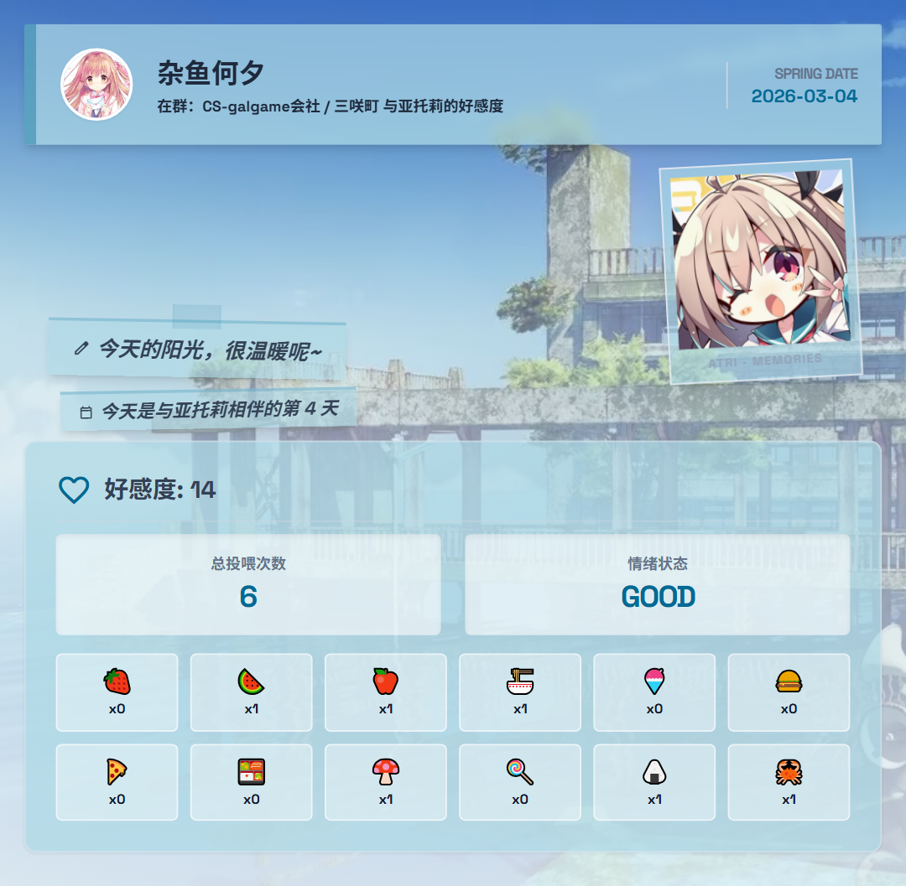
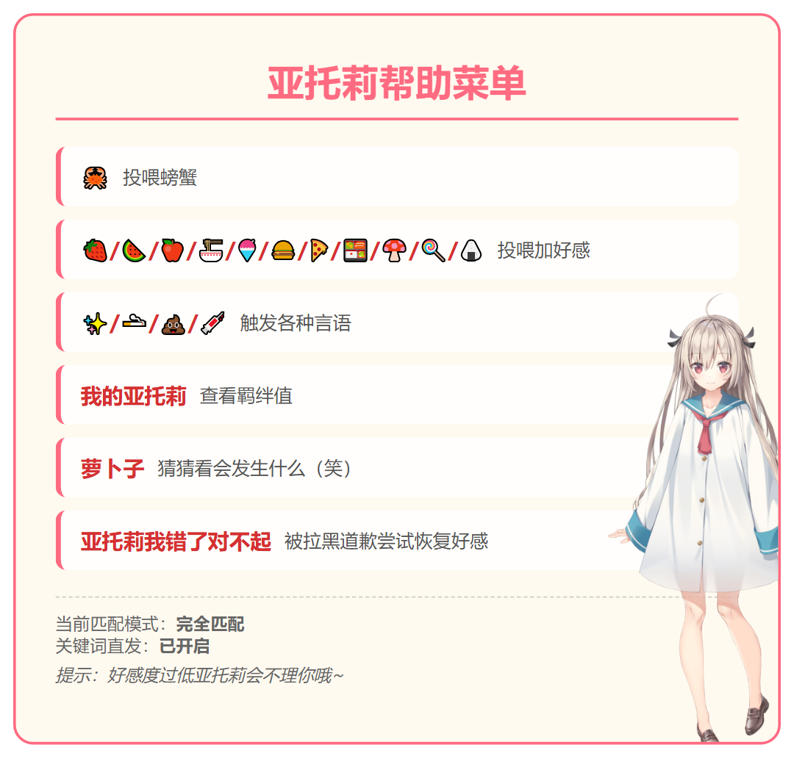

# AstrBot 亚托莉(ATRI) 投喂互动插件

基于AstrBot框架开发的高性能机器人互动插件。通过记录群内成员与亚托莉的互动数据，实现投喂、羁绊养成、黑名单惩罚等功能，并生成精美的个人羁绊名片。

> 关于桌宠：如果想要使用新的较为美观的UI，请点击左侧的平台日志，然后点击右上角的安装pip库，输入```PySide6```，astrbot可能不会自动下载此依赖

## ✨ 功能亮点

**🌸 动态羁绊与养成**：内置 SQLite 数据库，全方位追踪好感度、金币及互动统计。不仅是聊天，更是一场跨越维度的深度养成。

**🍎 多样化互动投喂**：支持螃蟹、水果、主食等多种物品投喂。每种食物均触发独特的逻辑反馈与好感加成，拒绝机械化回复。

**💰 完整的经济系统**：通过 `打工` 系统赚取金币，每日签到获取专属资源。

**📖 沉浸式剧情体验**：内置 `story` 剧情引擎，支持加密剧情文件与分支逻辑（如：朝圣之路），带你解锁与亚托莉的专属回忆。

**📝 每日群聊日记**：定时汇总多个目标 QQ 群当天的聊天记录，结合 AstrBot 人格生成一篇第一人称文字日记；支持本地保存、手动查看与自动发布 QQ 空间。

**🖥️ 实验性桌宠模式**：可在运行 AstrBot 的 Windows 本机启动 ATRI 桌宠。桌宠会在桌面上待机、行走、坐下、睡觉等，支持拖拽互动、右键动作菜单、双击聊天，并会读取插件侧的好感度、金币、背包等状态生成更贴近当前羁绊的回复。

**🎨 高清可视化名片**：基于 HTML 渲染引擎（Playwright/Template），一键生成精美个人名片、商店页面及打工结算图，视觉体验拉满。


## 📂 文件架构

<details>
<summary>点击展开完整文件架构</summary>

```text
astrbot_plugin_atrifeed/
├── main.py                   # 插件入口：注册指令、分发事件、初始化
├── keyword_trigger.py        # 核心路由：支持正则/模糊/精确匹配关键词的引擎
├── metadata.yaml             # 插件元数据
├── _conf_schema.json         # 配置项定义 (开关、触发模式等)
├── requirements.txt          # 依赖库清单
├── README.md                 # 项目说明文档
├── CHANGELOG.md              # 版本更新日志
├── LICENSE                   # 项目许可证
├── logo.png                  # 插件图标
│
├── src/                      # 核心逻辑目录
│   ├── __init__.py
│   ├── constants.py          # 存放默认关键词映射与常量定义
│   ├── ban.py                # 惩罚与道歉逻辑
│   ├── db/                   # 数据库操作中心
│   │   ├── __init__.py
│   │   ├── database.py       # 基础好感度、金币、黑名单管理
│   │   ├── database_shop.py  # 商店库存、购买逻辑处理
│   │   └── database_story.py # 剧情进度与存档管理
│   ├── command/              # 业务指令实现
│   │   ├── __init__.py
│   │   ├── feeding.py        # 投喂逻辑 (螃蟹、水果等)
│   │   ├── abuse.py          # 辱骂检测与处罚
│   │   ├── help.py           # 帮助菜单渲染
│   │   ├── my_atri.py        # 羁绊/属性卡片渲染
│   │   ├── shopping.py       # 商店指令实现
│   │   ├── backpack.py       # 背包查看功能
│   │   ├── use_item.py       # 物品使用逻辑
│   │   ├── sign_in.py        # 签到功能
│   │   ├── gig.py            # 打工系统
│   │   ├── dice.py           # 骰子博弈
│   │   ├── radish.py         # 萝卜子互动
│   │   ├── pat.py            # 动物表情包的反馈
│   │   └── other_emoji.py    # 针筒等特殊表情互动
│   ├── story/                # 剧情系统
│   │   ├── __init__.py
│   │   ├── story.py          # 剧情引擎主逻辑
│   │   ├── encryption.c      # 剧情文件加解密相关(C扩展)
│   │   └── pilgrimage/       # 特定剧情线
│   │       └── main_pilgrimage.yaml
│   ├── desktop_pet/          # 桌宠服务端：状态快照、本地 API、客户端进程管理
│   ├── diary/                # 每日日记：群历史、提示词、存储、调度与QQ空间发布
│   │   ├── message_reader.py # OneBot 群历史分页读取与消息文本化
│   │   ├── prompt_builder.py # 日记时间线和可编辑提示词模板
│   │   ├── qzone.py          # 复用当前 OneBot 连接发布QQ空间
│   │   ├── service.py        # 多群合并、人格读取、模型生成及任务调度
│   │   └── storage.py        # 日记JSON记录和防重复状态
│   └── utils/                # 工具类
│       ├── __init__.py
│       ├── utils.py          # 通用工具 (图片处理、消息构建等)
│       └── bayes_filter.py   # 贝叶斯垃圾内容/辱骂过滤算法
│
├── desktop_client/        # 桌宠客户端：桌面窗口、动画、拖拽、聊天框
│   ├── main.py            # 桌宠客户端入口
│   ├── pet_window_v2.py   # 桌宠窗口与交互
│   ├── chat_box_v2.py     # 双击打开的桌宠聊天框
│   └── prompts/           # 桌宠聊天提示词
│
├── data/                  # 文本数据集
│   ├── abuse.txt          # 辱骂词库
│   └── normal.txt         # 正常词库
│
├── pic/                   # 静态资源库
│   ├── atri_pet/          # ATRI 桌宠动作素材与 Shimeji 配置
│   ├── demo/              # README 展示用的演示图
│   ├── emoji/             # 互动表情包 (含子目录: angry, bad, radish, rocket, scare, tired, yes)
│   ├── lihui/             # 角色立绘库 (含普通、打工gig、商店shop立绘)
│   ├── pictorial/         # 插画与卡片背景素材
│   └── sign_in/           # 签到功能专用配图
│
└── template/              # HTML 渲染模板 (用于生成图片消息)
    ├── atri_help.html     # 帮助菜单模板
    ├── atri_sign_in.html  # 签到卡片模板
    ├── my_atri1.html      # 羁绊状态卡片模板
    ├── gig.html           # 打工结算模板
    └── shop.html          # 商店页面模板

```

</details>

## 🎮 使用指令

### 1. 基础互动与养成

| 指令/关键词 | 权限 | 说明 |
| --- | --- | --- |
| `亚托莉帮助` | 用户 | 渲染并发送插件详细功能指南 |
| `我的亚托莉` | 用户 | 查看羁绊值、金币及个人统计卡片 |
| `🦀` | 用户 | 投喂最爱的螃蟹|
| `🍓/🍉/🍎/🍜/🍧/🍔/🍕/🍱/🍄/🍭/🍙` | 用户 | 投喂各种食物以增加好感度 |
| `✨/🚬/💩/💉/💤` | 用户 | 触发各种有趣的特定言语反馈 |
| `萝卜子` | 用户 | 猜猜看会发生什么（笑） |
| `亚托莉我错了对不起` | 用户 | 被拉黑后的诚恳道歉，尝试恢复好感 |

### 2. 经济与日常

| 指令/关键词 | 权限 | 说明 |
| --- | --- | --- |
| `亚托莉签到` | 用户 | 每日签到，获取螃蟹币与体力奖励 |
| `亚托莉打工` | 用户 | 派遣机器人打工（消耗体力获取螃蟹币） |
| `亚托莉骰子` | 用户 | 摇骰子决定命运（随机增加好感与体力） |
| `商店` | 用户 | 查看今日上架商品并消耗螃蟹币购买 |
| `我的背包` | 用户 | 查看当前拥有的所有道具 |
| `使用 [物品名]` | 用户 | 使用背包中已拥有的特定物品 |

### 3. 剧情系统 (Story)

| 指令/关键词 | 权限 | 说明 |
| --- | --- | --- |
| `开始巡礼` | 用户 | 开启“圣地巡礼”剧情（需好感度 ≥ 300 且持有机票） |
| `继续前进` | 用户 | 在巡礼剧情中推进至下一个阶段 （巡礼途中可能会看见atri哦~）|

### 4. 管理员指令

| 指令/关键词 | 权限 | 说明 |
| --- | --- | --- |
| `/clear_feed_log` | 管理员 | 手动清空今日所有用户的投喂限制记录 |
| `解除拉黑 <QQ号>` | 可配置 | 解除指定用户的拉黑状态，并将好感度恢复为默认值 |

### 5. 桌宠模式（实验性）

在 AstrBot 管理面板开启 `desktop_pet_enabled` 后，插件会尝试在运行 AstrBot 的本机启动 ATRI 桌宠客户端。

| 操作 | 说明 |
| --- | --- |
| 左键拖拽 | 抓起并移动桌宠，拖拽速度不同会触发不同动作反馈 |
| 双击桌宠 | 打开聊天框，可与 ATRI 进行简短对话 |
| 右键桌宠 | 打开动作菜单，可手动切换待机、行走、坐下等动作 （未开发完成）|
| 自动状态同步 | 桌宠会读取当前用户的好感度、金币、背包等数据，并据此调整情绪与推荐动作（未开发完成） |

> 注意：桌宠模式目前仅建议在有桌面环境的 Windows 本机使用。若 AstrBot 运行在服务器、Docker 或无 GUI 环境中，桌宠窗口可能无法显示。

### 6. 每日日记与 QQ 空间

日记功能只读取配置中的目标 QQ 群，不读取私聊。多个群的当天记录会按时间合并为一篇全局日记，提示词中不会加入群号或群名。目前仅生成纯文字，不包含日记生图。

| 指令 | 默认权限 | 说明 |
| --- | --- | --- |
| `/日记生成 [YYYY-MM-DD]` | AstrBot 管理员 | 手动生成指定日期的日记，日期留空时生成今天；同一天可手动生成多篇 |
| `/日记列表` | AstrBot 管理员 | 显示全部日记的基础概览和最近10篇记录 |
| `/日记列表 [YYYY-MM-DD]` | AstrBot 管理员 | 显示指定日期的日记列表、字数和发布统计 |
| `/日记列表 all` | AstrBot 管理员 | 显示全部详细统计、本周统计及最长/最短日记 |
| `/日记查看 [YYYY-MM-DD] [编号]` | AstrBot 管理员 | 未给编号时列出当天日记；给出编号时查看具体正文 |
| `/日记发布 [YYYY-MM-DD] [编号]` | AstrBot 管理员 | 将已保存的日记手动发布或补发到 QQ 空间 |
| `/日记状态` | AstrBot 管理员 | 查看功能开关、目标群数量、执行时间和下次运行时间 |
| `/日记调试 [YYYY-MM-DD]` | AstrBot 管理员 | 实际拉取目标群历史并统计用户/Bot消息，不调用大模型 |
| `/日记帮助` | AstrBot 管理员 | 显示完整的日记指令说明 |

日记指令是 AstrBot 原生指令，不经过 `keyword_trigger` 和 `self._keyword_handlers`，因此不会绕过权限检查。`diary.command_permission` 支持以下三级权限：

1. 仅 Bot 管理员（默认）。
2. 群主和 Bot 管理员。
3. 群主、群管理员和 Bot 管理员。

群主和群管理员权限只在 QQ 群内生效；私聊执行日记指令时始终仅允许 AstrBot 管理员。

手动生成时，插件会先在当前会话发送“正在生成”的进度消息，完成后将日记正文回复到执行指令的群或私聊。若开启 `publish_qzone`，同一篇日记还会发布到当前机器人账号的 QQ 空间；即使空间发布失败，生成的正文仍会正常回复并保存。

#### 日记生成流程

```text
定时任务或管理员指令
  → 通过 AstrBot 当前 OneBot 连接分页拉取目标群历史
  → 按时间合并多个群的有效文字消息
  → 读取所选 AstrBot 人格或用户填写的人格提示词覆盖
  → 使用所选 AstrBot Provider 生成日记
  → 保存日记 JSON
  → 按 publish_qzone 开关决定是否发布 QQ 空间
```

日记记录保存在 AstrBot 插件数据目录下：

```text
data/plugin_data/astrbot_plugin_atrifeed/diary/
├── diaries/   # 每篇日记的 JSON 文件
└── state.json # 最近生成状态，用于防止定时任务重复发布
```

QQ 空间发布复用 AstrBot 已连接的 OneBot/NapCat 客户端获取登录账号和 Cookie，无需另外填写 NapCat 地址、端口、Token 或机器人 QQ 号。由于 QQ 空间发布使用 QQ 网页接口，接口变化、账号风控或 Cookie 权限异常都可能导致发布失败。

## 💡 关键词模式

若在配置中开启 `keyword_trigger_enabled`，则上述 emoji 和部分关键词可**直接发送**（不带类似于 `/` 的前缀）触发。

* 示例：直接在群里发一个 `🦀` 即可完成投喂。

## 🖼️ 功能演示





## ⚙️ 配置项说明

在 AstrBot 管理面板中可配置以下内容：

| 配置键 | 类型 | 默认值 | 说明 |
| --- | --- | --- | --- |
| `keyword_trigger_enabled` | bool | true | 是否启用关键词直接触发（无需前缀） |
| `keyword_trigger_mode` | string | exact | 匹配模式：`exact`(精确) / `starts_with`(开头) / `contains`(包含) |
| `global_ban_use_qq` | bool | true | 当好感低于5后，是否通过框架全局封禁该 QQ |
| `whitelist_groups` | list | [] | 白名单群号列表 |
| `blacklist_groups` | list | [] | 黑名单群号列表 |
| `bayes_abuse_detection` | bool | `true` | **贝叶斯辱骂检测**：利用概率模型判断恶意言论。若喜欢和 Bot 斗嘴建议关闭，以免误伤好感度。 |
| `welcome_enabled` | bool | `false` | 是否启用入群欢迎功能 |
| `desktop_pet_enabled` | bool | `false` | 是否启用实验性桌宠模式。开启后会在运行 AstrBot 的 Windows 本机启动 ATRI 桌宠客户端 |

### 日记二级配置 `diary`

| 配置键 | 类型 | 默认值 | 说明 |
| --- | --- | --- | --- |
| `diary.enabled` | bool | `false` | 开启后启动每日日记定时任务 |
| `diary.publish_qzone` | bool | `true` | 生成后是否自动发布到 QQ 空间；关闭时仍生成并保存日记 |
| `diary.command_permission` | string | `仅bot管理员` | 日记管理指令权限，可放宽至群主或群管理员 |
| `diary.schedule_time` | string | `23:30` | 每日生成时间，格式为 `HH:MM` |
| `diary.timezone` | string | `Asia/Shanghai` | 日记日期和定时任务使用的时区 |
| `diary.platform_id` | string | 空 | 多个 OneBot 实例时指定用于拉取记录和发布空间的平台；单实例通常留空 |
| `diary.target_groups` | list | `[]` | 目标 QQ 群号列表，多个群合并生成一篇日记 |
| `diary.min_message_count` | int | `3` | 合并后允许生成日记的最少消息总数 |
| `diary.min_messages_per_group` | int | `3` | 单个群参与合并所需的最少消息数 |
| `diary.max_messages_per_group` | int | `1000` | 每个群单次任务最多回溯的消息数 |
| `diary.include_bot_messages` | bool | `true` | 是否把机器人自己的回复加入日记素材 |
| `diary.enable_emotion_analysis` | bool | `true` | 是否根据聊天关键词生成“晴、雨、多云”等心情天气 |
| `diary.word_count` | int | `200` | 日记目标和最终最大字数，允许范围为 20–8000 |
| `diary.provider_id` | string | 空 | 日记使用的 AstrBot 模型；留空时使用首个目标群的聊天模型 |
| `diary.persona_id` | string | 空 | 从 AstrBot 已有人格中选择日记人格 |
| `diary.persona_prompt` | text | 空 | 可编辑的人格提示词覆盖；非空时优先于所选人格 |
| `diary.prompt_template` | text | 内置模板 | 可在配置页编辑的日记完整提示词模板 |

`diary.prompt_template` 支持以下变量，修改模板时建议保留：

| 变量 | 内容 |
| --- | --- |
| `${personality}` | 最终使用的人格提示词 |
| `${date}` | 日记日期 |
| `${time_desc}` | “到现在为止”或“这一天” |
| `${timeline}` | 多个群合并后的聊天时间线 |
| `${target_length}` | 目标字数 |
| `${date_with_weather}` | 日期、星期和心情天气 |

### 日记 CLI 日志与排障

日记任务会在 AstrBot CLI 中记录处理进度，包括目标群进度、历史消息页码、每页数量、有效消息累计、模型与人格选择、提示词长度、大模型耗时、返回字数以及 QQ 空间发布结果。日志不会打印完整聊天正文、人格全文或完整提示词。

常见问题：

- **只收到“正在生成”**：请确认插件已经更新并重载。新版进度消息使用直接发送，不会被结果装饰插件提前截断生成流程。
- **没有拉取记录**：确认平台为 OneBot/NapCat、目标群号正确，且协议端支持 `get_group_msg_history`。
- **消息数量不足**：降低 `min_message_count` 或 `min_messages_per_group`，或提高 `max_messages_per_group`。
- **找不到模型或人格**：在日记二级配置中重新选择 Provider/人格，或填写 `persona_prompt`。
- **QQ 空间发布失败**：确认当前机器人 QQ 可以正常访问空间，并检查 CLI 中的 Cookie、HTTP 状态和 `tid` 日志。
- **定时任务没有启动**：确认 `diary.enabled=true`、目标群列表非空，且 `schedule_time` 和时区格式正确。

本插件依赖 AstrBot 的浏览器渲染引擎：

1. **Playwright**：用于渲染 `template/` 下的 HTML 模板，请确保环境已安装。（一般自带，不用管）
2. **资源路径**：请勿随意移动 `pic/` 文件夹，否则会导致表情包发送失败。
3. **分词库**：更新插件会自动安装。
4. **日记网络依赖**：`httpx` 用于发布 QQ 空间，`tzdata` 用于跨平台时区处理，更新插件时会按 `requirements.txt` 自动安装。

## ❤️ 致谢

本项目的开发离不开以下开源项目与社区的支持：

* **[AstrBot](https://github.com/astrbotdevs/astrbot)**：感谢 Soulter 提供的强大且易用的生态框架。
* **星火燃愿**：感谢星火燃愿提供的巡礼图片的处理支持
* **[Furina010013](https://github.com/Furina010013)**:感谢提供的代码贡献支持
* **[Bing2Na冰](https://space.bilibili.com/34884714?spm_id_from=333.788.upinfo.detail.click)**：感谢Bing2Na冰提供亚托莉桌宠的思路与素材
* **[shimeji](https://kilkakon.com/shimeji/)**：感谢shimeji引擎提供的源代码参考

觉得亚托莉可爱的话，就给个 star 吧 ❤️~
